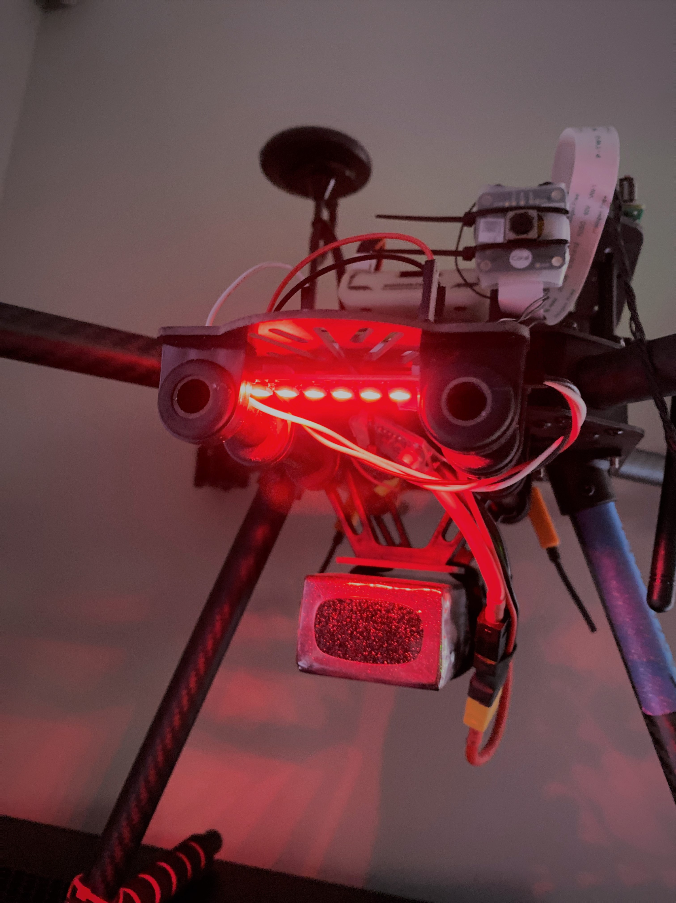

# Battery LED w/ Teensy LC

## Introduction

This "Project Guide" is written to show some of the capabilites of NavQ. In conjunction with a Teensy LC and a strip of WS2812B LEDs, you can add a forward-facing battery indicator light to your drone.



## Prerequisites

### Software

The software needed to run this project on your NavQ is as follows:

1. ROS Noetic
2. MAVROS

You can install this software using the guides here:





### Hardware

The hardware needed is the same as the hardware from the I2C guide here:



## Code

At the moment, we're just going to paste the code here, and a more detailed guide will be written later.

### Teensy code

This code should be uploaded to the Teensy using the Arduino IDE. 



### NavQ code

The ROS node should be placed in the home folder \('/home/navq/'\)



The service file should be located in /etc/systemd/system/.



The Launch script should be located in /usr/local/bin/.



### Making the ROS node run on boot

Once all of the necessary files are placed in their respective directories, you need to make the systemd service run at boot. To do this, run in the terminal:

```text
$ sudo systemctl enable batt_led
```

